###########################
How to run blackbox-testing
###########################

.. contents::

============
Prerequisite
============

- Install docker, docker-compose
- Install postman https://www.getpostman.com/apps
- Clone repo from https://github.com/edgexfoundry/blackbox-testing

============
Setup env.sh
============
We need to set up the environment variables for the test script.

1. Open file **path/to/blackbox-testing/deploy-edgeX.sh** and uncomment below code snippet:  

. $(dirname "$0")/bin/env.sh

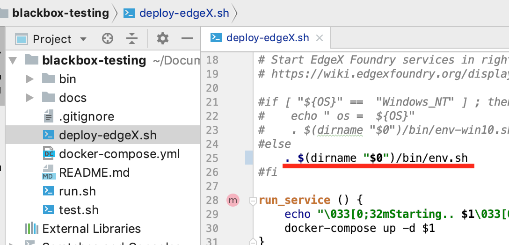

2. Open file **path/to/blackbox-testing/bin/run.sh** and uncomment below code snippet: 

. $(dirname "$0")/env.sh

============
Deploy EdgeX
============

Change directory to **path/to/blackbox-testing/**, execute below command:

.. code-block:: bash

        $ bash deploy-edgeX.sh

Then we will see the console output like:

.. code-block:: bash

    $ bash deploy-edgeX.sh
    Starting.. volume
    WARNING! Using --password via the CLI is insecure. Use --password-stdin.
    Login Succeeded
    Creating network "blackbox-testing_edgex-network" with driver "bridge"
    Creating blackbox-testing_volume_1 ... done
    Starting.. consul
    WARNING! Using --password via the CLI is insecure. Use --password-stdin.
    Login Succeeded
    blackbox-testing_volume_1 is up-to-date
    Creating blackbox-testing_consul_1 ... done
    ...
    ...
    Starting.. command
    WARNING! Using --password via the CLI is insecure. Use --password-stdin.
    Login Succeeded
    blackbox-testing_volume_1 is up-to-date
    blackbox-testing_mongo_1 is up-to-date
    blackbox-testing_consul_1 is up-to-date
    blackbox-testing_logging_1 is up-to-date
    blackbox-testing_metadata_1 is up-to-date
    Creating blackbox-testing_command_1 ... done

We can check EdgeX services by command docker ps:

.. code-block:: bash

    $ docker ps
    CONTAINER ID        IMAGE                                                              COMMAND                  CREATED             STATUS              PORTS                                                                                                            NAMES
    f1b490b3e0c3        nexus3.edgexfoundry.org:10004/docker-core-command-go:0.5.2         "/core-command --con…"   3 minutes ago       Up 3 minutes        0.0.0.0:48082->48082/tcp                                                                                         blackbox-testing_command_1
    055dc4d48442        nexus3.edgexfoundry.org:10004/docker-core-data-go:0.5.2            "/core-data --consul…"   3 minutes ago       Up 3 minutes        0.0.0.0:48080->48080/tcp, 0.0.0.0:32781->5563/tcp                                                                blackbox-testing_data_1
    e0aa5a675d7d        nexus3.edgexfoundry.org:10004/docker-core-metadata-go:0.5.2        "/core-metadata --co…"   3 minutes ago       Up 3 minutes        0.0.0.0:48081->48081/tcp, 48082/tcp                                                                              blackbox-testing_metadata_1
    deaa276c175f        nexus3.edgexfoundry.org:10004/docker-support-notifications:0.5.0   "/bin/sh -c 'java -j…"   3 minutes ago       Up 3 minutes        0.0.0.0:48060->48060/tcp                                                                                         blackbox-testing_notifications_1
    18336488dba4        nexus3.edgexfoundry.org:10004/docker-support-logging-go:0.5.2      "/support-logging --…"   4 minutes ago       Up 4 minutes        0.0.0.0:48061->48061/tcp                                                                                         blackbox-testing_logging_1
    05896fe88e17        nexus3.edgexfoundry.org:10004/docker-edgex-mongo:master            "docker-entrypoint.s…"   4 minutes ago       Up 4 minutes        0.0.0.0:27017->27017/tcp                                                                                         blackbox-testing_mongo_1
    85d0e33c4924        nexus3.edgexfoundry.org:10004/docker-core-config-seed-go:master    "docker-entrypoint.s…"   4 minutes ago       Up 4 minutes        8300-8302/tcp, 8400/tcp, 8500/tcp, 8301-8302/udp, 8600/tcp, 8600/udp                                             blackbox-testing_config-seed_1
    9e4bf85969d7        consul:1.1.0                                                       "docker-entrypoint.s…"   4 minutes ago       Up 4 minutes        0.0.0.0:8400->8400/tcp, 8301-8302/udp, 0.0.0.0:8500->8500/tcp, 8300-8302/tcp, 8600/udp, 0.0.0.0:8600->8600/tcp   blackbox-testing_consul_1
    47f532468383        nexus3.edgexfoundry.org:10004/docker-edgex-volume:master           "/bin/sh -c '/usr/bi…"   4 minutes ago       Up 4 minutes                                                                                                                         blackbox-testing_volume_1

==================
Run test by Newman
==================

First of all, the script logic is:

- mport test data into Edgex
- Run test script by Newman
- Clean test data

For example, when we execute bash **./bin/run.sh -cd**, then the script logic is:

- Import core-data's test data into Edgex
- Run core-data's test script by Newman
- Clean core-data's test data

And the output will like:

.. code-block:: bash

    $ bash ./bin/run.sh -cd
    -cd
    *********************************************
        ______   _    _    _____   ______
    |  ____| | |  | |  / ____| |  ____|
    | |__    | |  | | | (___   | |__
    |  __|   | |  | |  \___ \  |  __|
    | |      | |__| |  ____) | | |____
    |_|       \____/  |_____/  |______|
    
    *********************************************
        COMPONENT BLACKBOX TEST HARNESS
                Version: Alpha
    *********************************************
    
    [INFO] Init postman test data .
    Info: Initiating Coredata Test
    
    ...
    ...
    ...

    Starting blackbox-testing_volume_1 ... done
    newman
    
    core-data
    
    ❏ event_error_4xx
    ↳ 05 http://localhost:48080/api/v1/event
    PUT edgex-core-data:48080/api/v1/event [404 Not Found, 173B, 26ms]
    ✓  Status code is 404
    ✓  Response time is less than 800
    
    ↳ 16 http://localhost:48080/api/v1/event/id/:id
    PUT edgex-core-data:48080/api/v1/event/id/57e866d4e4b0ca8e6d73a412 [404 Not Found, 173B, 4ms]
    ✓  Status code is 404
    ✓  Response time is less than 800
    
    ↳ 13 http://localhost:48080/api/v1/event/id/:id
    DELETE edgex-core-data:48080/api/v1/event/id/57e866d4e4b0ca8e6d73a412 [404 Not Found, 173B, 3ms]
    ✓  Status code is 404
    ✓  Response time is less than 800
    
    ↳ 18 http://localhost:48080/api/v1/event/device/:deviceId/{limit}
    GET edgex-core-data:48080/api/v1/event/device/57e866d4e4b0ca8e6d73a412/100 [200 OK, 110B, 2ms]
    ✓  Response time is less than 800
    
    ↳ 100 http://localhost:48080/api/v1/event/device/:deviceId
    DELETE edgex-core-data:48080/api/v1/event/device/preassureSensor [200 OK, 108B, 2ms]
    ✓  Response time is less than 800
    
    ↳ 22 http://localhost:48080/api/v1/event/device/:deviceId
    DELETE edgex-core-data:48080/api/v1/event/device/57e866d4e4b0ca8e6d73a412 [200 OK, 108B, 2ms]
    ✓  Response time is less than 800
    
    ┌─────────────────────────┬──────────┬──────────┐
    │                         │ executed │   failed │
    ├─────────────────────────┼──────────┼──────────┤
    │              iterations │        1 │        0 │
    ├─────────────────────────┼──────────┼──────────┤
    │                requests │        6 │        0 │
    ├─────────────────────────┼──────────┼──────────┤
    │            test-scripts │        6 │        0 │
    ├─────────────────────────┼──────────┼──────────┤
    │      prerequest-scripts │        0 │        0 │
    ├─────────────────────────┼──────────┼──────────┤
    │              assertions │        9 │        0 │
    ├─────────────────────────┴──────────┴──────────┤
    │ total run duration: 283ms                     │
    ├───────────────────────────────────────────────┤
    │ total data received: 53B (approx)             │
    ├───────────────────────────────────────────────┤
    │ average response time: 6ms                    │
    └───────────────────────────────────────────────┘

So after deploy services, we can test service's API by the command:

======================  ======================
Testservice             command 
----------------------  ----------------------    
support-rulesengine	     bash ./bin/run.sh -ru
support-notification	 bash ./bin/run.sh -sn
support-logging	         bash ./bin/run.sh -log
export-client	         bash ./bin/run.sh -exc
core-metadata	         bash ./bin/run.sh -md
core-data	             bash ./bin/run.sh -cd
core-command	         bash ./bin/run.sh -co
All	                     bash ./bin/run.sh -all 
======================  ======================  

Or we can just run bash ./bin/run.sh to see all usages:

.. code-block:: bash

    $ bash ./bin/run.sh
    ...
    ...
    [INFO] Init postman test data .
    run.sh:usage: [-cd Coredata] | [-md Metadata] | [-co Command] | [-sn SupportNotification] | [-lo Logging] | [-exc Export Client] | [-ru Rulesengine] | [-all All]

===================
Run test by Postman
===================

Postman also a good tool to run the tests or add more test APIs and update test assertions.

The test is same logic, just like execute bash **./bin/run.sh -cd**. But there are many detail steps need to do.

And we choose core-data test as our example.

---------------------------
Import test data into Edgex
---------------------------

1. Add script which locates at your_path/to/blackbox-testing/bin/postman-test/collections/core-data-importer.postman_collection.json 

1-1. Drop or choose the file

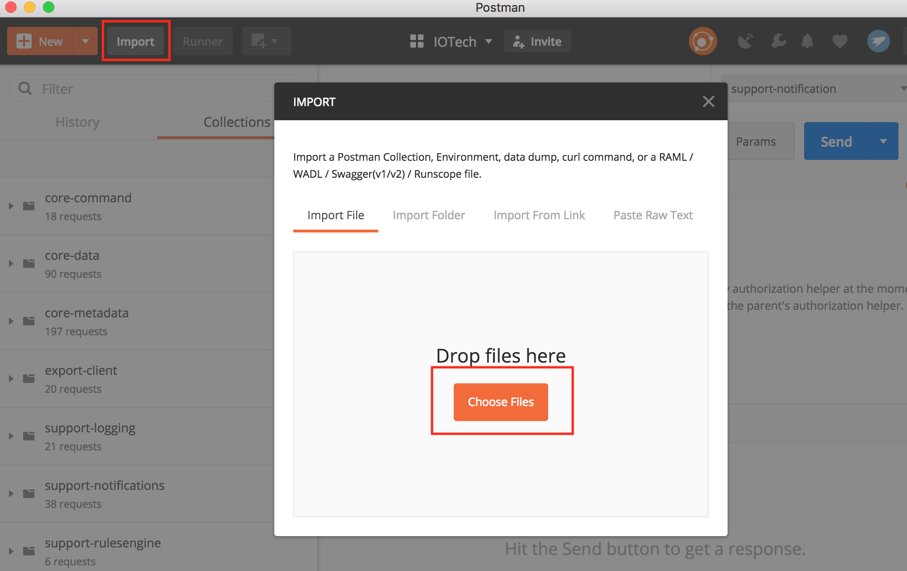

1-2. Prepared test data under the tab of Pre-request Script

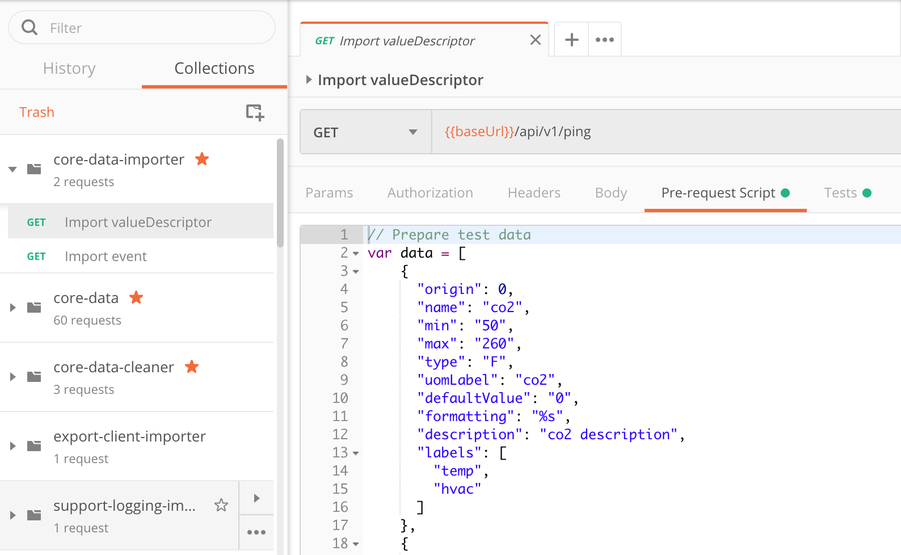

1-3.  Script under the tab of Tests. This script executes POST API for add new test data.

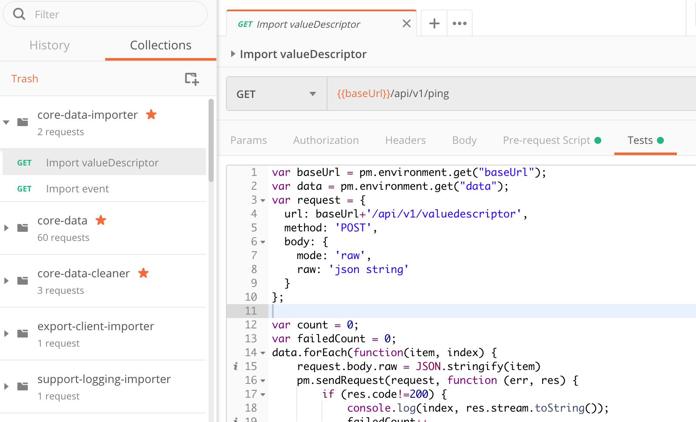

2. Import environment which locates at **path/to/blackbox-testing/bin/postman-test/environment/core-data.postman_environment.json** 

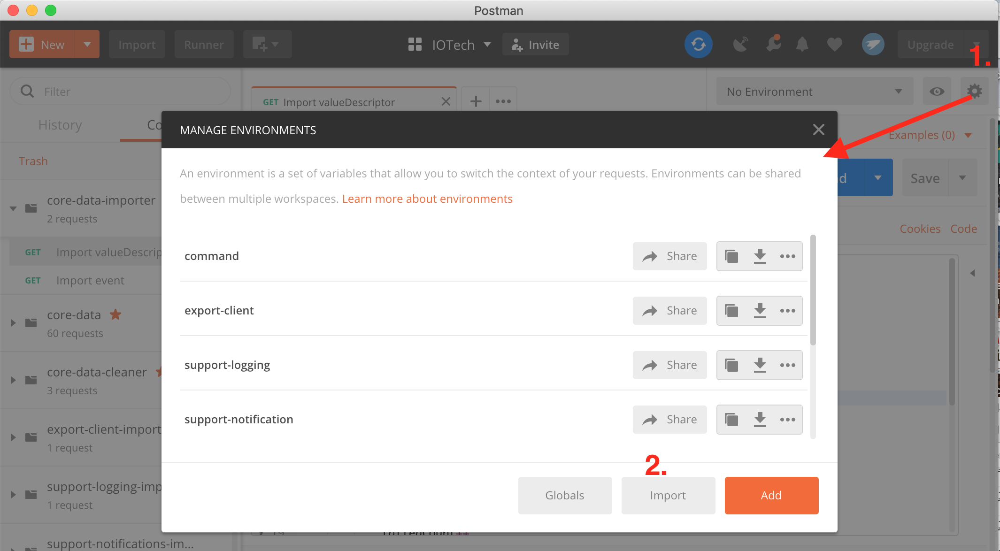
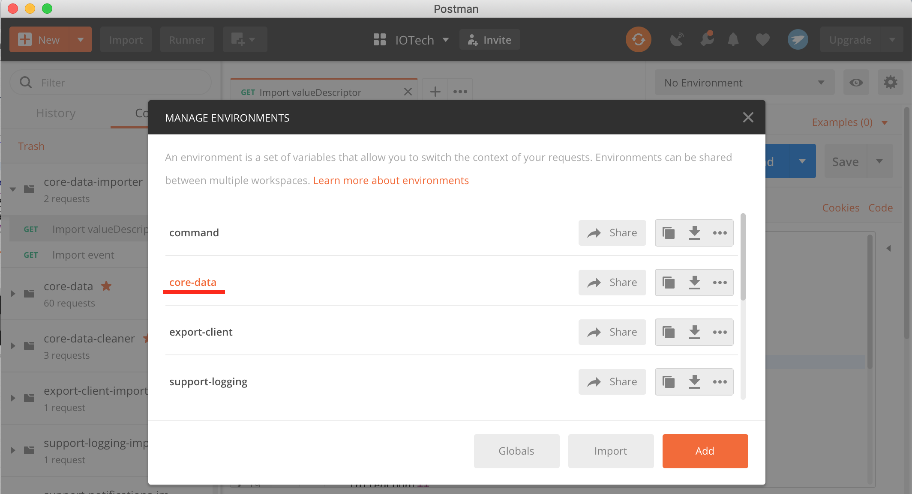

3. Execute the import script

3-1. Execute the import script one by one

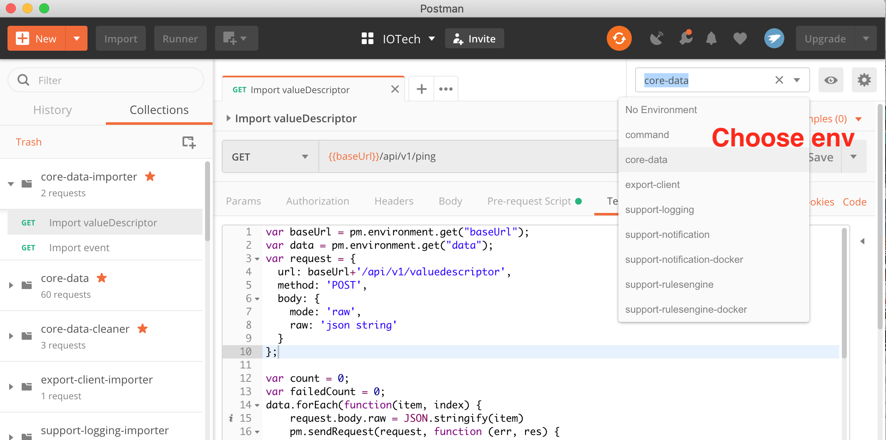
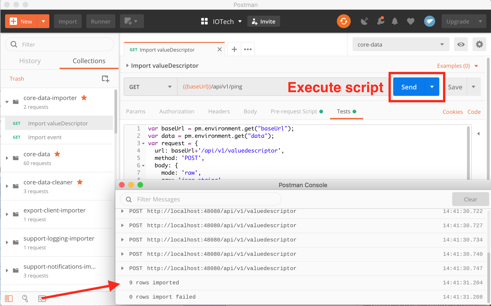

3-2. Or you can execute the import scripts by Postman Runner

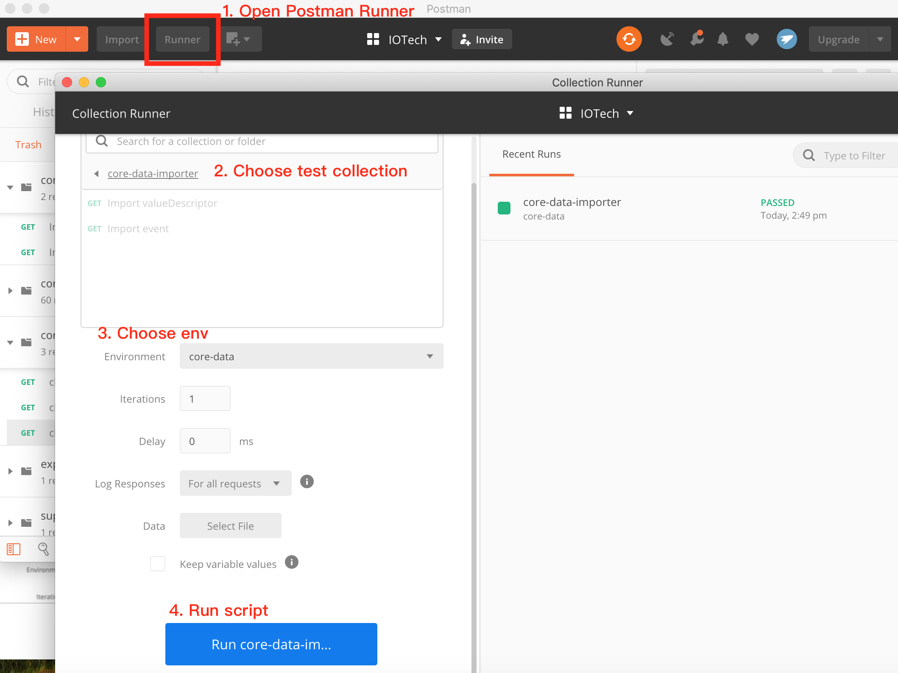

--------------------------
Run test script by Postman
--------------------------

1. Import collection.json file **path/to/blackbox-testing/bin/postman-test/collections/core-data.postman_collection.json** , this json file describes the testing APIs and test assertions.

2. Choose a test folder and env

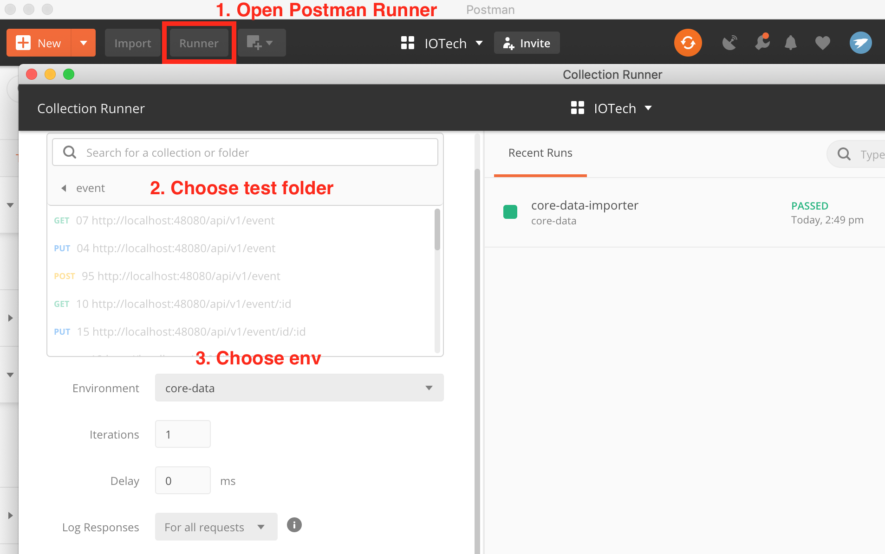

3. Select test data file **path/to/blackbox-testing/bin/postman-test/data/eventData.json** and run tests.

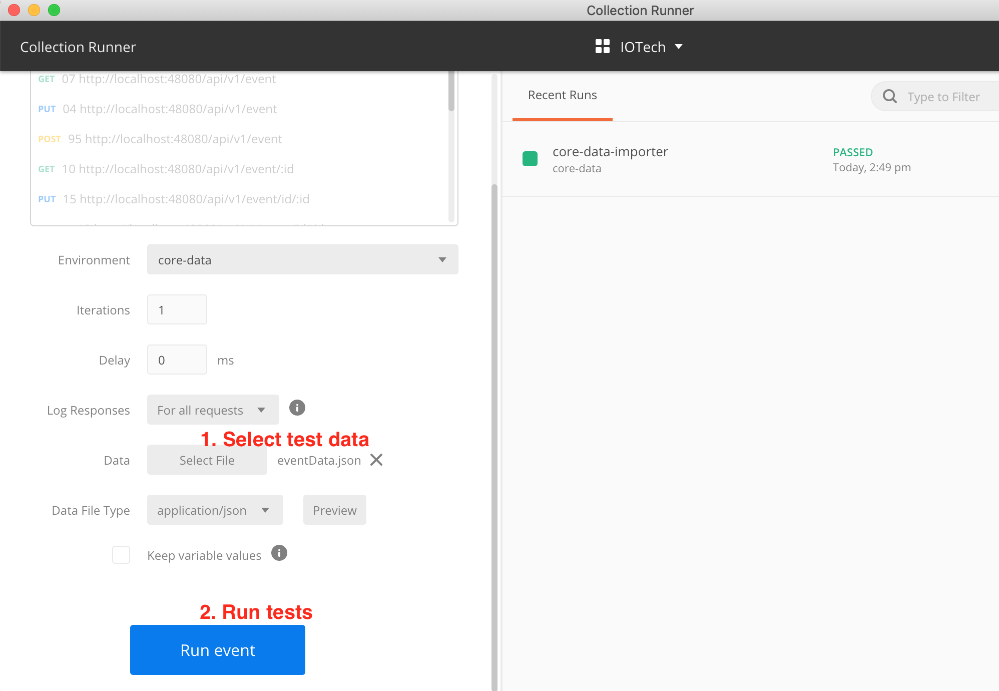

4. Then we will see the test result.

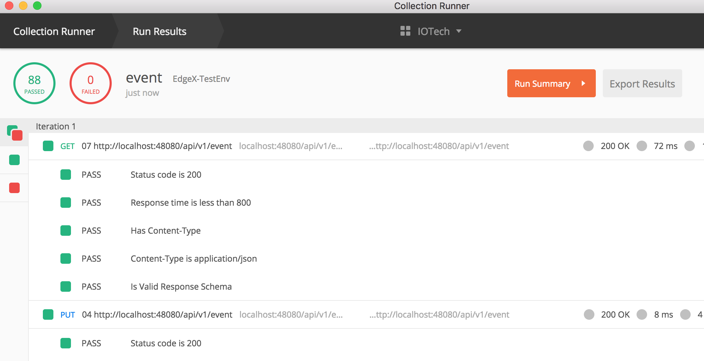

---------------
Clean test data
---------------

1. Add script which locates at **path/to/blackbox-testing/bin/postman-test/collections/core-data-cleaner.postman_collection.json**

2. Execute the clean script

2-1. Execute the clean script one by one

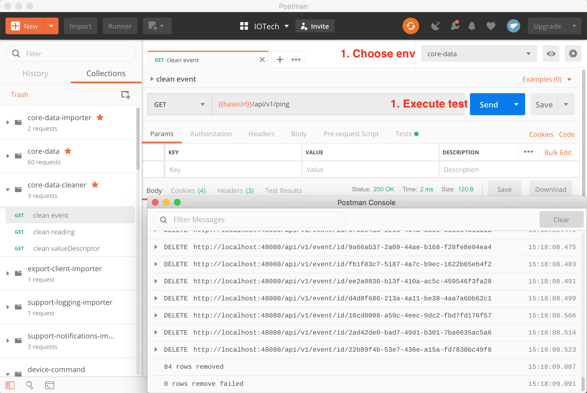

2-2. Or you can execute the clean scripts by Postman Runner

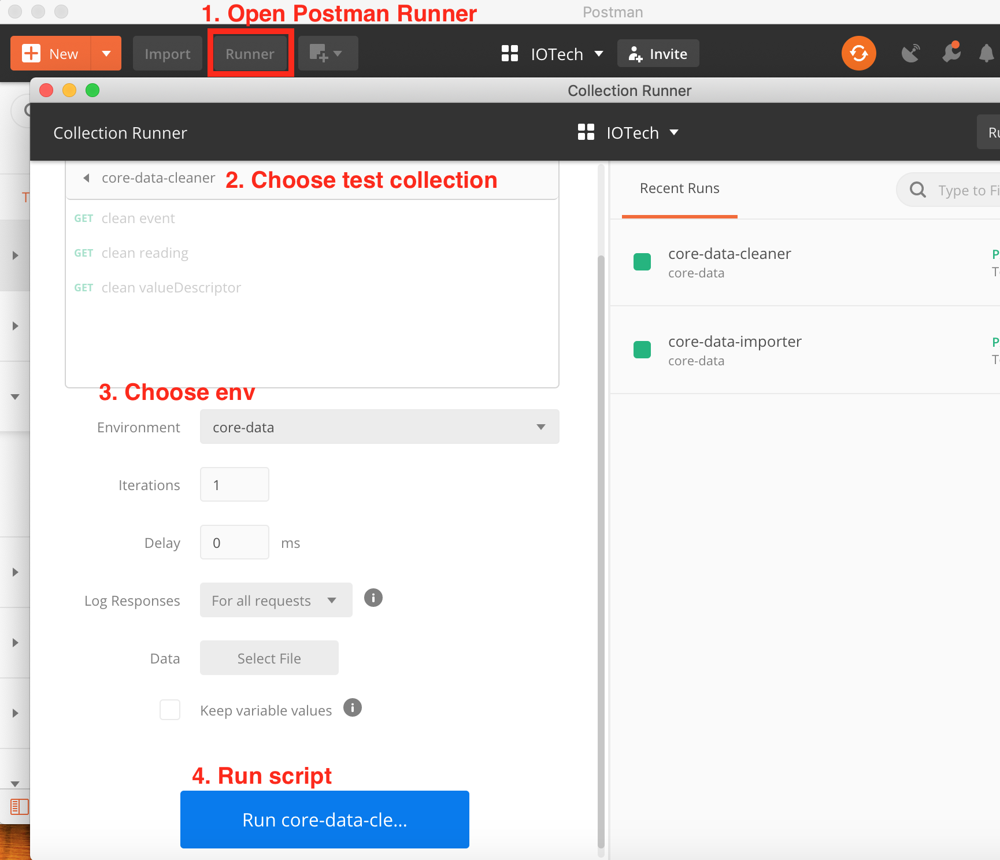